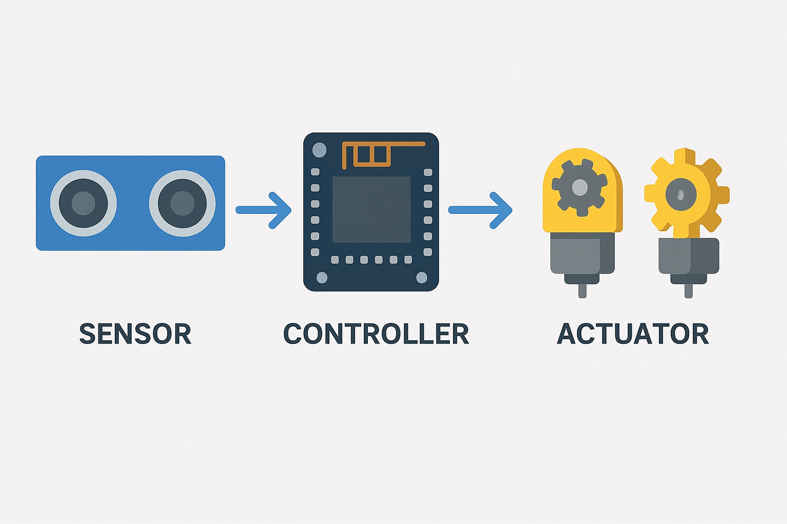
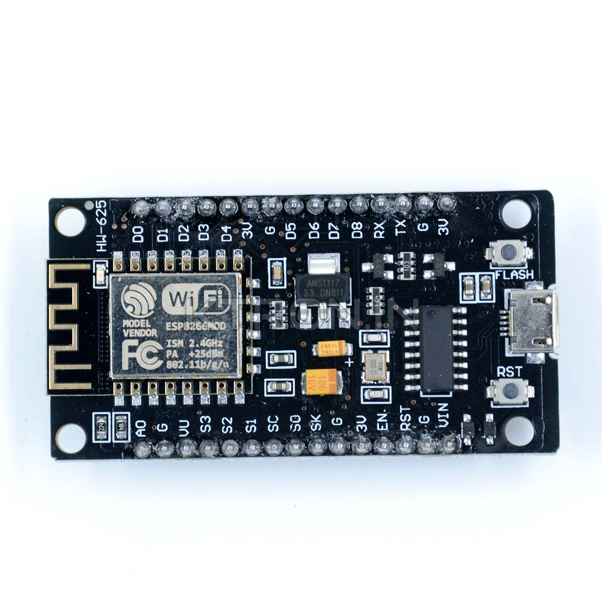
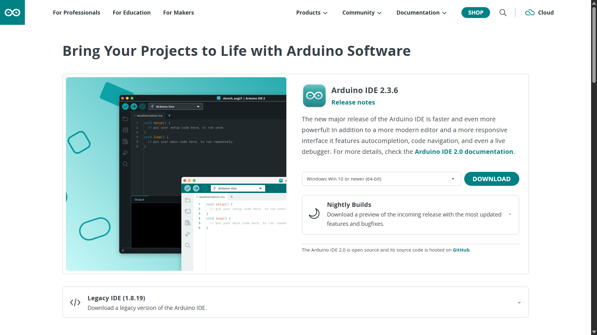
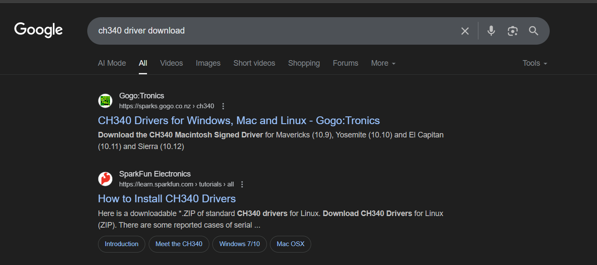
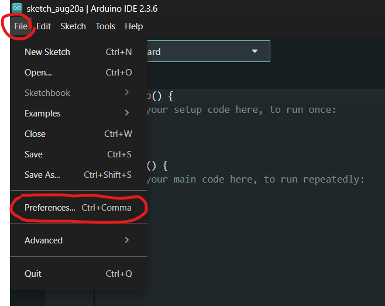
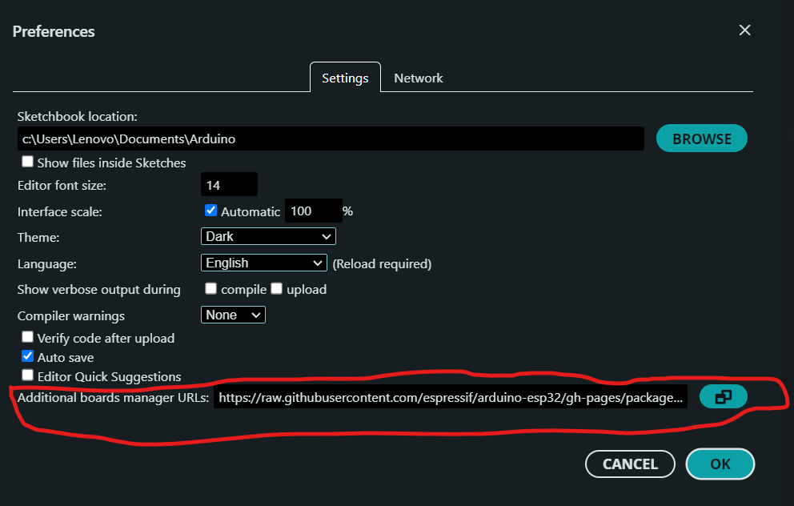
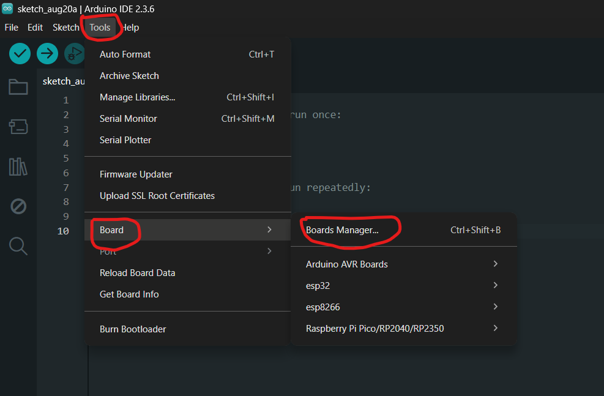
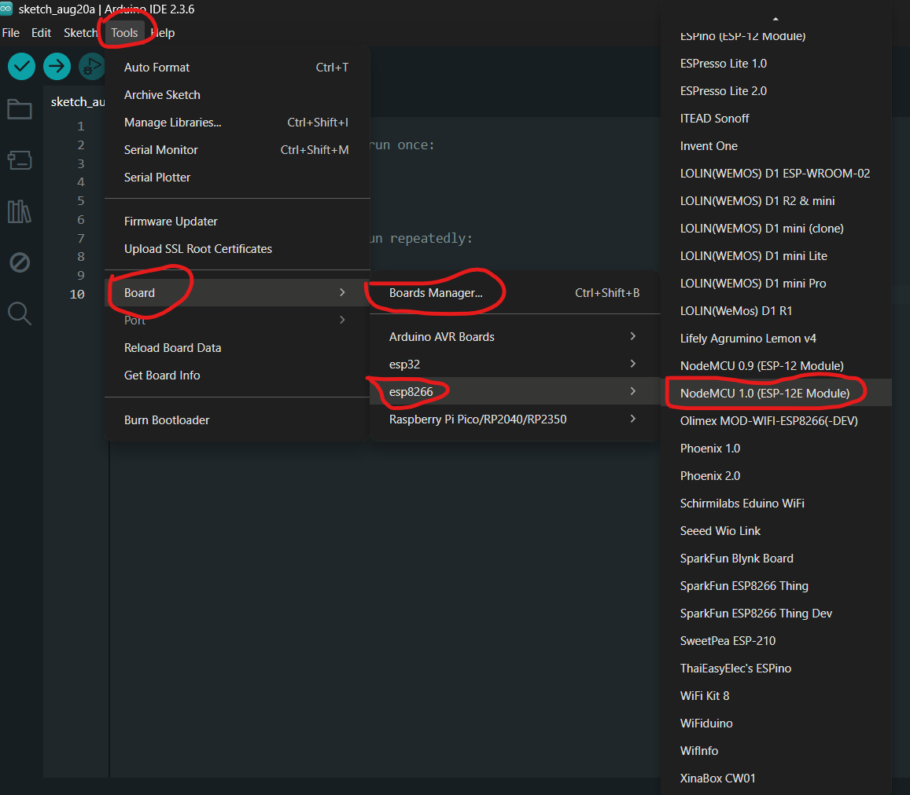
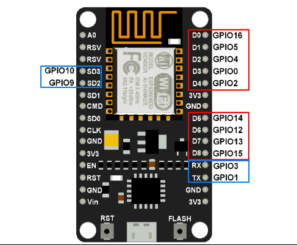
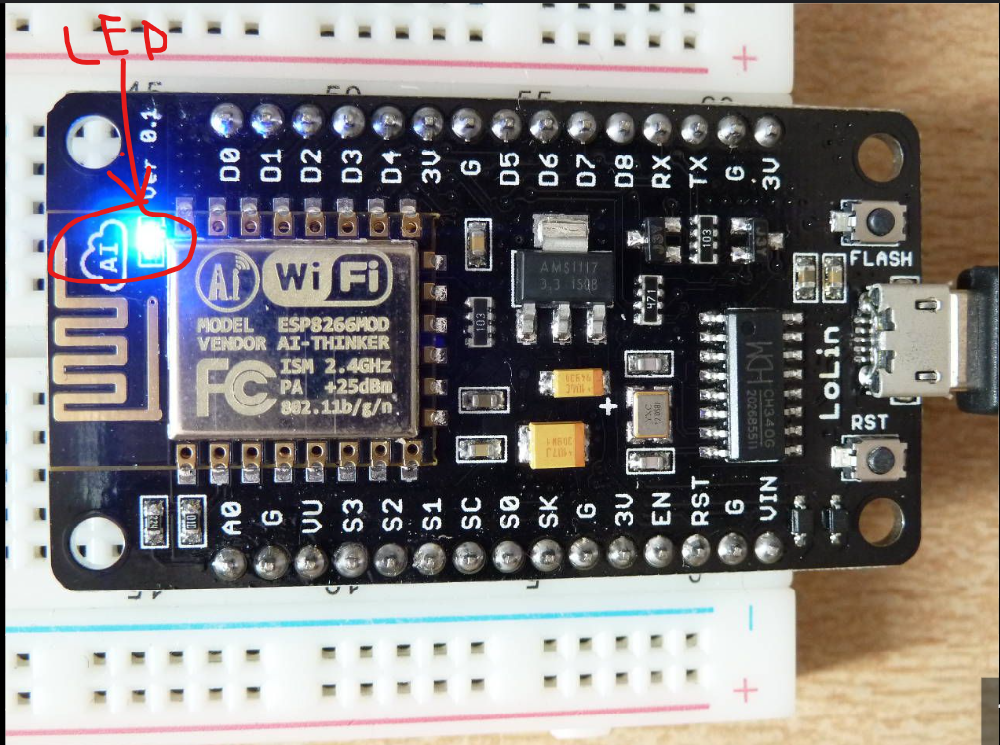

# Day 2: "Hello, World!" - Your First Step into IoT Programming

**Yesterday we learned about the three main parts of IoT and Robotics:** Sensors (Senses 👀), Controller (Brain 🧠), and Actuators (Muscles 💪). **Today, we will learn more about the Controller (Brain) and create our first program!**

## Today's Goal 🎯
To understand that a controller is like a "brain" that we can program, and see how code connects to hardware in real life.

---

## 1. Understanding Controllers: The Brain 🧠

Yesterday we said the controller is like the brain of our system. Let's understand this better.

### What is a Controller?
A controller is a **small computer**, also called a **Microcontroller**. It has its own memory, processing power, and input/output pins. It's just like our brain that can think and make decisions.

**Real Example:** Just like your brain decides to wear a sweater when it's cold, a controller decides to turn on a fan when the temperature is too high.
**[IMAGE: ]**
### Why Do We Need Controllers?
Without a controller, our system can't do anything. Sensors can collect data, but only the controller can decide what to do with that data.

**Example:** 
- Temperature sensor tells us the room is hot (35°C)
- Now, should we turn on the fan or not? The controller (brain) makes this decision  
- And gives commands to the motor (muscle)

### How Does a Controller Work?
We give the controller a set of instructions, called **code or program**. The controller reads these instructions line by line and works according to them.

**Simple Workflow:**
```
INPUT → PROCESS → OUTPUT
Sensor Data → Controller Decision → Actuator Action
```

**[IMAGE: ]**

---

## 2. Today's Controller: NodeMCU ESP8266 🔌

We will use the **NodeMCU ESP8266** microcontroller board in this workshop.

### What is it?
NodeMCU is a popular, low-cost microcontroller board that has an **ESP8266 chip** inside. It's a small circuit board that will become the brain of our projects.



### Why Are We Using This?

**1. Built-in Wi-Fi:** Its biggest feature is that it has Wi-Fi already built in. This helps us connect our projects to the internet easily (the 'I' in Internet of Things!).

**2. Easy to Program:** It's very easy to program using popular tools like Arduino IDE.

**3. Affordable:** It's very cheap, so it's perfect for students and hobbyists.

**4. GPIO Pins:** It has many pins to connect sensors and actuators.

### How Will It Work?
We will connect it to our computer using a USB cable, write code on it, and "upload" the code into its brain. After uploading, it can work separately from the computer and follow our code instructions.

---

## 3. Hands-on Activity: Let's Make LED Blink! 💡

This is like "Hello, World!" in programming. We will make the small light (LED) on the NodeMCU blink (turn on-off). This will teach us how to control hardware using code.

### Things We Need:
- NodeMCU ESP8266 Board
- Micro-USB Cable (that supports data transfer)
- Computer/Laptop
**[IMAGE: ]**

---

## 4. Step-by-Step Guide 📋

### Part 1: Preparing Your Computer ⚙️

#### Step 1: Install Arduino IDE

**What is it?** Arduino IDE (Integrated Development Environment) is software where we will write, check, and upload code for our microcontroller. It's like a combination of a text editor and compiler.

**Why do we need it?** It converts our code into a language that the microcontroller can understand (machine code). Like a translator that converts English to Hindi.

**How to install:**
1. Go to Arduino Software website (arduino.cc)
2. Download the installer for your operating system (Windows/Mac)



3. Open the downloaded file and install it
4. After installation, open Arduino IDE

**[VIDEO: Complete Arduino IDE installation process step-by-step]**

---

#### Step 2: Install USB Driver (CH340)

**What is it?** A driver is a small software that helps your computer talk to the NodeMCU board. Most NodeMCU boards use the **CH340 chip**.

**Why do we need it?** Without the driver, your computer won't recognize the board. It's like not being able to talk to someone who speaks a different language. The driver works as a translator.

**How to install:**
1. Search online for CH340 driver and download it



2. Extract the file and run the installer as **Administrator**
3. Restart your computer after installation

**[VIDEO: Complete CH340 driver installation process]**

4. **Check:** Go to Device Manager and see if "USB-SERIAL CH340" is showing

**[SCREENSHOT: Windows Device Manager showing CH340 driver properly installed]**

---

#### Step 3: Configure Arduino IDE for NodeMCU

**What is this?** By default, Arduino IDE only knows about Arduino boards. We need to tell it that we want to use an ESP8266 board.

**Why?** So the IDE knows how to compile code for ESP8266 and what features it has. Every board has its own programming style.

**How to do it:**
1. Open Arduino IDE
2. Go to `File` > `Preferences`



3. In the "Additional Board Manager URLs" box, paste this link:
   ```
   http://arduino.esp8266.com/stable/package_esp8266com_index.json
   ```



**What does this link do?** This link tells Arduino IDE where to find all the information about ESP8266 on the internet. Like giving someone an address where they can find ESP8266 information.

4. Click `OK`
5. Now go to `Tools` > `Board` > `Boards Manager...`




6. Type "esp8266" in the search box
7. Find "esp8266 by ESP8266 Community" and click `Install`

**[GIF: Complete process of searching and installing ESP8266 board package]**

**Why this installation?** This step actually downloads all the files, libraries, and examples needed to program ESP8266. Like collecting all the tools needed for a new job.

---

### Part 2: Programming and Uploading 🚀

#### Step 4: Select Correct Board and Port

**Board Selection:**
1. Connect your NodeMCU to the computer using USB cable


2. In Arduino IDE, go to `Tools` > `Board` > `ESP8266 Boards` and select **"NodeMCU 1.0 (ESP-12E Module)"**




**Port Selection:**
3. Now go to `Tools` > `Port`. You will see a COM port (like COM3, COM4). Select it.

**[SCREENSHOT: COM port selection in Tools menu]**

**What is COM Port?** It's like a phone number for your NodeMCU. The computer uses this to "call" the board.

**If no port is showing:** 
- Your driver is not installed properly
- USB cable doesn't support data transfer (it's only a charging cable)
- Board is not connected properly

---

#### Step 5: Understanding GPIO Pins

**What are GPIO Pins?**
GPIO means **General Purpose Input/Output**. These are physical pins on the board where we can connect sensors (input) and actuators (output). 



On NodeMCU, these pins have names written on the board itself, like D1, D2, D3, D4, etc.


**Important:** The blue LED on the board is connected to pin **D4**. We will use this name (D4) in our code because it's clearly visible on the board and easy to understand.



---

#### Step 6: Write and Understand the Blink Code

Copy the code below and paste it in the Arduino IDE editor:

```cpp
/*
  Hello World of Physical Computing: Blinking an LED
  This program will make the onboard LED of NodeMCU blink.
  The blue LED on the board is connected to pin D4.
*/

// setup() function runs only once when the board starts or resets.
void setup() {
  // We need to set pin D4 to OUTPUT mode, 
  // because we will send signals to the LED.
  pinMode(D4, OUTPUT);
}

// loop() function runs forever, after setup().
void loop() {
  digitalWrite(D4, LOW);    // Turn LED ON (NodeMCU turns ON with LOW)
  delay(1000);              // Wait for 1000 milliseconds (1 second)
  digitalWrite(D4, HIGH);   // Turn LED OFF (NodeMCU turns OFF with HIGH)
  delay(1000);              // Wait for 1 second
}
```

### Understanding the Code Line by Line:

**[DIAGRAM: Code flow visualization showing setup() running once, then loop() running forever]**

**`void setup()`** 
- **What:** This function runs only once when the board powers on
- **Why:** To do initial settings, like installing a light switch in your house
- **When:** When the board starts or when you press the reset button

**`pinMode(D4, OUTPUT)`**
- **What:** Sets pin D4 to OUTPUT mode  
- **Why:** So the pin can send signals out (control the LED)
- **OUTPUT vs INPUT:** OUTPUT = sends signals, INPUT = receives signals

**[DIAGRAM: Pin modes - INPUT (receiving) vs OUTPUT (sending) with arrows]**

**`void loop()`**
- **What:** This function repeats forever
- **Why:** To do continuous work, like a heartbeat
- **When:** Starts after setup() and never stops

**`digitalWrite(D4, LOW)`**
- **What:** Sends LOW signal (0V) to pin D4
- **Why:** In NodeMCU, the LED turns ON with LOW signal (opposite logic)
- **LOW vs HIGH:** LOW = 0V, HIGH = 3.3V

**[DIAGRAM: Digital signals - HIGH (3.3V) vs LOW (0V) with voltage meter]**

**`delay(1000)`**
- **What:** Stops the program for 1000 milliseconds (1 second)
- **Why:** To give the LED visible time in ON/OFF state
- **1000 milliseconds = 1 second**

---

#### Step 7: Upload the Code! 🚀

1. Click the **right-arrow (→) button** at the top of IDE. This is the "Upload" button
2. IDE will first **compile** the code (check if there are any errors) 
3. Then it will **upload** it to the board
4. Wait for the **"Done uploading."** message in the console below

**[SCREENSHOT: Arduino IDE toolbar with Upload button highlighted]**

**What happens during Upload?**
- **Compile:** Convert human code to machine code
- **Transfer:** Send machine code to board through USB  
- **Store:** Code gets saved in board's memory
- **Execute:** Board starts running the code

**[DIAGRAM: Upload process flow - Code → Compile → Transfer → Store → Execute]**

**Congratulations! 🎉** The blue LED on your NodeMCU board should now be blinking every second. You have successfully controlled hardware using code!

**[GIF: NodeMCU blue LED blinking on and off repeatedly for 10 seconds]**

---

## 5. Let's Experiment! 🔬

Now the real fun begins. Change `delay(1000);` in the code and see what happens.

### Speed Experiments:
- **Fast Blink:** `delay(200);` - LED will blink quickly
- **Slow Blink:** `delay(3000);` - LED will blink slowly  
- **Super Fast:** `delay(50);` - LED will blink very fast
- **Very Slow:** `delay(5000);` - LED will blink very slowly

**[GIF: LED blinking at different speeds - fast, normal, slow comparison]**

### Different Patterns:
```cpp
// Unequal ON/OFF time
digitalWrite(D4, LOW);   // ON
delay(100);              // Short ON time
digitalWrite(D4, HIGH);  // OFF  
delay(2000);             // Long OFF time
```

**[GIF: LED showing different patterns - morse code style, heartbeat pattern]**

**After each change, upload the code again** and see how it affects the LED speed. This will clearly show you how **a small change in software (code) can completely change hardware (LED) behavior.**

---

## 6. Troubleshooting: If Something Goes Wrong 🛠️

### Problem: Board is Not Detected
**Solutions:**
- Install CH340 driver properly
- Try a different USB cable (data transfer supported)
- Check Device Manager

**[SCREENSHOT: Device Manager showing "Unknown Device" - problem scenario]**

### Problem: Upload Error is Coming  
**Solutions:**
- Check board selection (NodeMCU 1.0)
- Select correct COM port
- Press RESET button on board during upload

**[SCREENSHOT: Upload error message in Arduino IDE console]**

### Problem: LED is Not Blinking
**Solutions:**
- Check D4 pin number in code
- Verify if upload was successful
- Try restarting the board

**[VIDEO: Troubleshooting steps demonstration]**

---

## 7. What We Learned Today 🎓

1. **Controller = System's Brain** - All decisions happen here
2. **NodeMCU ESP8266** = Affordable brain with WiFi
3. **Programming** = Giving step-by-step instructions to machines
4. **Arduino IDE** = Tool for writing and uploading code
5. **setup() = Runs once, loop() = Repeats forever**
6. **Code changes = Hardware behavior changes**

**Most Important:** **You controlled hardware using code!** This is the basic concept of IoT - controlling the physical world through software.

---

## Tomorrow Preview: Day 3 🔮
Tomorrow we will learn:
- External LEDs and resistors
- Breadboard connections  
- Reading real sensor data
- Making decisions based on sensor data
- Sending data to the internet

**Remember:** Today you became a programmer! You can now control machines through code! 🎉

**Happy Coding! 💻✨**