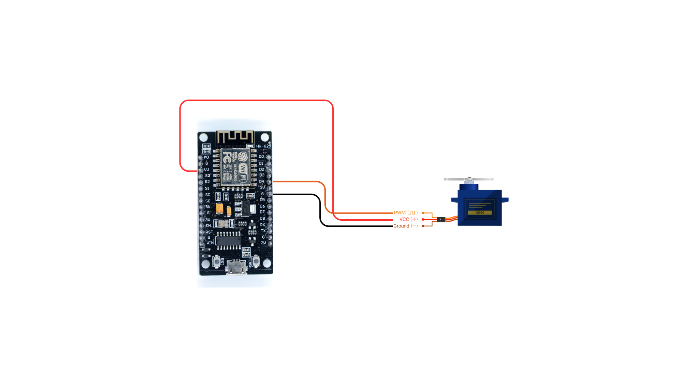
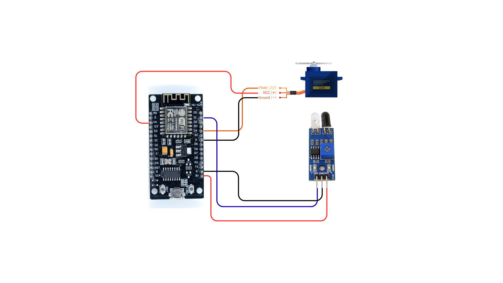

# Day 4: "Taking Action" - Controlling Actuators

Yesterday, we gave our system "senses" using Sensors (INPUT Devices). Today, we will complete the cycle by giving our system "muscles" to perform actions using Actuators (OUTPUT Devices).

## Today's Goal:

- Understand that actuators are devices that perform physical actions.
- Learn about different types of actuators and the need for motor drivers.
- Control a Servo Motor and make it rotate to specific angles.

## 1. Recap of Day 3: Giving the System Senses 🧠

Yesterday, we learned:

- Sensors are INPUT devices that collect information from the environment.
- We used an IR Sensor to detect if an object was present.
- We completed a full cycle: Sense (IR sensor), Think (if/else logic), and Act (turning on an LED).

## 2. Understanding Actuators: The Muscles of a System 💪

### What are Actuators?
Actuators are the "hands and legs" of our system. They are devices that take an electrical signal from the controller and turn it into a physical action, like movement, light, or sound. They are OUTPUT devices because they produce an output in the real world.

### Why are they important?
Without actuators, a robot or IoT device can sense and think, but it can't do anything. Actuators allow our projects to move, make sounds, or interact with the world.

## 3. Some Common Actuators

### LED (Light Emitting Diode)

**What is it?** An LED is a simple actuator that produces light. As we saw yesterday, we can control it to give signals or act as an indicator.

**Where is it used?** Indicators on all electronics, lighting, displays.

### DC Motor

**What is it?** A DC motor spins continuously when you give it power. You can change its direction, but you can't easily control its exact position.

**Where is it used?** Toy cars, fans, robot wheels.

### Servo Motor

**What is it?** A servo motor is a special type of motor that can rotate to a specific angle (usually between 0 and 180 degrees) and hold that position.

**Where is it used?** Robotic arms, airplane flaps, automatic gates, and steering systems.

### Buzzer

**What is it?** A buzzer is a tiny speaker that produces a buzzing sound or a beep when it receives a signal.

**Where is it used?** Alarms, doorbells, timers, and giving feedback in projects.

## 4. An Important Helper: The Motor Driver

### What is a Motor Driver?
A motor driver is an electronic circuit that acts as a bridge between the microcontroller (like NodeMCU) and a motor.

### Why do we need it?
Motors, especially DC motors, need more electrical current (power) to run than a microcontroller pin can safely provide. If you connect a DC motor directly to a NodeMCU pin, you could damage the controller. The motor driver takes a small signal from the controller and uses a separate, higher power source to run the motor safely.

### What about Servo Motors?

Servo motors have a small driver circuit built inside them! That's why we can connect our small SG90 servo directly to the NodeMCU. The internal circuit handles the power management for us.

## 5. Hands-on Activity: Controlling a Servo Motor

We will now connect a servo motor to our NodeMCU and write code to control its angle precisely.

### Things You'll Need:
- NodeMCU
- Breadboard
- Jumper Wires
- SG90 Servo Motor
- Computer/Laptop with Arduino IDE

### Connection Diagram:
The Servo Motor has 3 wires:

- **Brown Wire (GND)** → Connect to a GND pin on the NodeMCU.
- **Red Wire (VCC)** → Connect to the VV pin on the NodeMCU (for 5V power).
- **Orange Wire (Signal)** → Connect to the D4 pin on the NodeMCU.



## Programming the Servo 💻

To control a servo easily, we use a pre-written set of code called a library. The Servo.h library comes built-in with the Arduino IDE.

### Step 1: Write the Code
Copy the code below into the Arduino IDE.

```cpp
/*
  Day 4: Controlling a Servo Motor
  This program will make a servo motor sweep back and forth.
*/

// 1. Include the Servo library
#include <Servo.h>

// 2. Create a servo object
Servo myServo;

void setup() {
  // 3. Attach the servo to pin D4
  myServo.attach(D4);
}

void loop() {
  // Move the servo to 0 degrees
  myServo.write(0);
  delay(1000); // Wait for 1 second

  // Move the servo to 90 degrees
  myServo.write(90);
  delay(1000); // Wait for 1 second

  // Move the servo to 180 degrees
  myServo.write(180);
  delay(1000); // Wait for 1 second
}
```

### Step 2: Upload the Code
Upload the code to your NodeMCU. You should see the servo motor move to 0, then 90, then 180 degrees, with a one-second pause at each position.

### Let's Experiment!
Try changing the values inside `myServo.write()`. Can you make it move to 45 degrees? Or 135 degrees? Change the code and upload it again to see the result.

## Bonus Activity: The Automatic Barrier Gate

Let's combine Day 3 and Day 4! We will build a smart barrier that opens automatically when the IR sensor detects something (like a car or your hand).

### Connections:
Keep the connections for both the IR sensor on pin D1 and the Servo Motor on pin D4.



### Write the Code:
This code combines the logic from both days.

```cpp
/*
  Day 4: Bonus Activity - Automatic Barrier
  This program opens a servo "gate" when the IR sensor detects an object.
*/

#include <Servo.h>

Servo myServo;

void setup() {
  // Setup the sensor and actuator pins
  pinMode(D1, INPUT);     // IR Sensor is an INPUT
  myServo.attach(D4);     // Servo Motor is an OUTPUT

  // Start with the gate closed
  myServo.write(0);
}

void loop() {
  // 1. SENSE: Read the value from the IR sensor
  int objectDetected = digitalRead(D1);

  // 2. THINK: Check if an object is detected (value is 0)
  if (objectDetected == 0) {
    // 3. ACT: Open the gate
    myServo.write(90);
  } else {
    // 3. ACT: Close the gate
    myServo.write(0);
  }
}
```

Upload this code. Now, the servo will stay at 0 degrees (gate closed). When you bring your hand in front of the IR sensor, the servo will move to 90 degrees (gate open)! When you move your hand away, it will close again.

**You have now built a complete, smart system that can Sense, Think, and Act!**