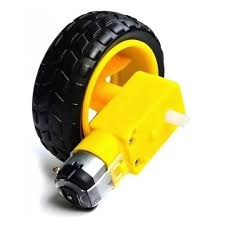
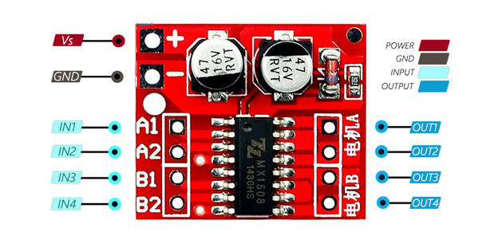
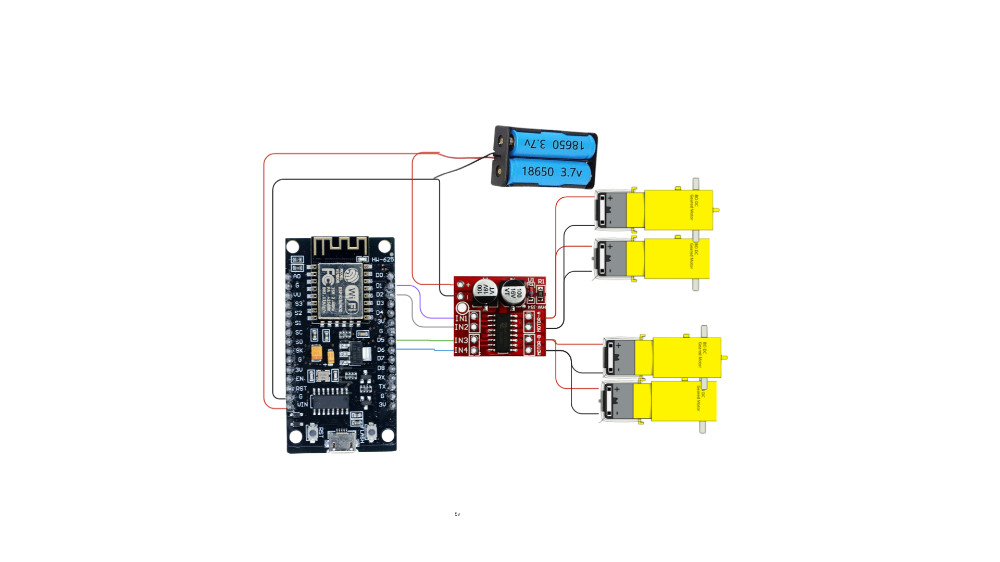

# Day 5: Project Day - Wi-Fi Controlled Car

This is the day everything comes together! We will use all the skills we've learned—from controlling the brain to using sensors and actuators—to build a complete project: a car that you can drive using your phone!

---

## Today's Goal

- Combine our knowledge of controllers, actuators, and drivers.
- Learn how to create a Wi-Fi network to send commands wirelessly.
- Build and program a fully functional Wi-Fi controlled robot car.

---

## 1. Recap: The Story So Far 📖

- **Day 1:** We learned the basics: Sensors, Controllers, and Actuators.
- **Day 2:** We programmed our Controller to control a simple actuator (LED).
- **Day 3:** We added Sensors to see the world and made our system react.
- **Day 4:** We learned to control Actuators like servo motors with precision.

Today, we're building a robot that uses powerful motors as actuators and Wi-Fi for communication.

---

## 2. New Hardware for Our Car

### Geared DC Motors

The small yellow motors we will use are Geared DC Motors. The gearbox on the front reduces the motor's speed but increases its torque (turning power). This is important for a robot car, giving it the strength to move.



These motors are compact and efficient, making them ideal for small robotic vehicles like ours.

### MX1508 Motor Driver

Remember from Day 4 how motors need more power than the NodeMCU can provide? For our car's motors, we will use a dedicated MX1508 Motor Driver.

- **What is it?** It's a small circuit board designed to control two DC motors.
- **Why use it?** It's a bridge. We send small, safe signals from our NodeMCU to the driver, and the driver uses a separate power source (like a battery pack) to run the motors. It allows us to easily control the motor's direction (forward/backward) and speed.

 



---

## 3. Hands-on Project: Building the Wi-Fi Car

Let's assemble our car and get it ready for the final code.

### Things You'll Need

- Car Chassis, Wheels, and Geared DC Motors
- NodeMCU
- 1 x MX1508 Motor Driver
- Jumper Wires
- A separate power source for the motors (e.g., a 2x Lithium battery pack).  
  *Do not power the motors from the NodeMCU.*

### Connection Diagram

#### Power for the Driver

- Connect your battery pack's **+ (positive)** to the **VCC** pin on the MX1508.
- Connect your battery pack's **- (negative/ground)** to the **GND** pin on the MX1508.  
  Also, connect this GND to a GND pin on the NodeMCU (this is a crucial step to make them work together).

#### Motors to Driver

- Connect the **Left Motor** to the **MOTOR A** terminals on the driver.
- Connect the **Right Motor** to the **MOTOR B** terminals on the driver.

#### NodeMCU to Driver (Control Signals)

- NodeMCU D1 → MX1508 IN1 (Left Motor)
- NodeMCU D2 → MX1508 IN2 (Left Motor)
- NodeMCU D5 → MX1508 IN3 (Right Motor)
- NodeMCU D6 → MX1508 IN4 (Right Motor)



---

## 4. Step 1: Test Your Motors!

Before adding the complex Wi-Fi code, it's very important to test if our motors are wired correctly. This simple code will make the car move forward for 2 seconds, then backward for 2 seconds.

### Motor Test Code

Upload this code to your NodeMCU.

```cpp
// === Motor Pins (for MX1508 driver) ===
#define MOTOR_A1 D1 // Left Motor IN1
#define MOTOR_A2 D2 // Left Motor IN2
#define MOTOR_B1 D5 // Right Motor IN1
#define MOTOR_B2 D6 // Right Motor IN2

void setup() {
  // Setup motor pins as OUTPUTs
  pinMode(MOTOR_A1, OUTPUT);
  pinMode(MOTOR_A2, OUTPUT);
  pinMode(MOTOR_B1, OUTPUT);
  pinMode(MOTOR_B2, OUTPUT);
}

void loop() {
  // Move Forward at full speed
  analogWrite(MOTOR_A1, 255);
  digitalWrite(MOTOR_A2, LOW);
  analogWrite(MOTOR_B1, 255);
  digitalWrite(MOTOR_B2, LOW);
  delay(2000); // Wait 2 seconds

  // Stop for a moment
  digitalWrite(MOTOR_A1, LOW);
  digitalWrite(MOTOR_A2, LOW);
  digitalWrite(MOTOR_B1, LOW);
  digitalWrite(MOTOR_B2, LOW);
  delay(1000); // Wait 1 second

  // Move Backward at full speed
  digitalWrite(MOTOR_A1, LOW);
  analogWrite(MOTOR_A2, 255);
  digitalWrite(MOTOR_B1, LOW);
  analogWrite(MOTOR_B2, 255);
  delay(2000); // Wait 2 seconds

  // Stop for a moment
  digitalWrite(MOTOR_A1, LOW);
  digitalWrite(MOTOR_A2, LOW);
  digitalWrite(MOTOR_B1, LOW);
  digitalWrite(MOTOR_B2, LOW);
  delay(1000); // Wait 1 second
}
```

**After uploading:**  
If both wheels move forward and then backward, your wiring is correct!  
If one wheel moves in the wrong direction, just swap the two wires for that motor on the motor driver.

---

## 5. Step 2: The Final Code for Wireless Control!

Once the motors are tested, it's time for the final code. This will turn our NodeMCU into a Wi-Fi hotspot.

Copy and paste this entire code into your Arduino IDE.

```cpp
#include <ESP8266WiFi.h>
#include <ArduinoOTA.h>
#include <WiFiUdp.h>
#include <ArduinoJson.h>

// === Motor Pins (for MX1508 driver) ===
#define MOTOR_A1 D1 // Left Motor IN1
#define MOTOR_A2 D2 // Left Motor IN2
#define MOTOR_B1 D5 // Right Motor IN1
#define MOTOR_B2 D6 // Right Motor IN2

// === Other Pins ===
const int buzPin = D8;
const int ledPin = D0;
const int wifiLedPin = D4;

// === Constants for Speed Control ===
const int MAX_PWM = 400;          // Maximum PWM value for motors (0-255)
const int MIN_WORKING_SPEED = 80; // Minimum speed where motors actually move
const int DEADZONE = 5;           // Joystick deadzone to prevent drift

// === UDP Setup ===
WiFiUDP udp;
const unsigned int udpPort = 4210;
char udpBuffer[256];

// === Failsafe Timer ===
unsigned long lastUdpCommandTime = 0;
const unsigned long UDP_FAILSAFE_TIMEOUT = 500; // ms

// === WiFi Credentials ===
const char* WIFI_SSID = "wifi-car-1";
const char* WIFI_PASSWORD = "12345678";

void setup() {
  Serial.begin(115200);
  Serial.println("\nWiFi Robot Remote Control Mode (MX1508)");

  pinMode(buzPin, OUTPUT);
  pinMode(ledPin, OUTPUT);
  pinMode(wifiLedPin, OUTPUT);
  
  digitalWrite(buzPin, LOW);
  digitalWrite(ledPin, LOW);
  digitalWrite(wifiLedPin, HIGH);

  pinMode(MOTOR_A1, OUTPUT);
  pinMode(MOTOR_A2, OUTPUT);
  pinMode(MOTOR_B1, OUTPUT);
  pinMode(MOTOR_B2, OUTPUT);
  stopMotors();

  WiFi.mode(WIFI_AP);
  WiFi.softAP(WIFI_SSID, WIFI_PASSWORD); // Use variables for SSID and password
  Serial.print("AP IP address: ");
  Serial.println(WiFi.softAPIP());
  digitalWrite(wifiLedPin, LOW);

  ArduinoOTA.begin();
  udp.begin(udpPort);
}

void loop() {
  ArduinoOTA.handle();

  int packetSize = udp.parsePacket();
  if (packetSize) {
    int len = udp.read(udpBuffer, sizeof(udpBuffer) - 1);
    if (len > 0) udpBuffer[len] = 0;

    StaticJsonDocument<192> doc;
    DeserializationError error = deserializeJson(doc, udpBuffer);
    if (!error) {
      int forward = doc["forward"] | 0;
      int backward = doc["backward"] | 0;
      int left = doc["left"] | 0;
      int right = doc["right"] | 0;

      bool lightOn = false;
      bool hornOn = false;
      if (doc["btn"].is<JsonArray>()) {
        for (JsonVariant v : doc["btn"].as<JsonArray>()) {
          String b = v.as<String>();
          if (b == "light") lightOn = true;
          if (b == "horn") hornOn = true;
        }
      }

      int y = forward - backward;
      int x = right - left;

      controlMotion(y, x);

      digitalWrite(ledPin, lightOn ? HIGH : LOW);
      digitalWrite(buzPin, hornOn ? HIGH : LOW);

      // Update failsafe timer
      lastUdpCommandTime = millis();
    }
  }

  // === Failsafe: Stop motors if no UDP command received in timeout ===
  if (millis() - lastUdpCommandTime > UDP_FAILSAFE_TIMEOUT) {
    stopMotors();
    // Optionally, turn off horn and light as well:
    digitalWrite(ledPin, LOW);
    digitalWrite(buzPin, LOW);
  }
}

// === Motor Control Functions (Updated for MX1508) ===

// This function stops the motors by setting both input pins to LOW (coast)
void stopMotors() {
  digitalWrite(MOTOR_A1, LOW);
  digitalWrite(MOTOR_A2, LOW);
  digitalWrite(MOTOR_B1, LOW);
  digitalWrite(MOTOR_B2, LOW);
}

// Drives the two motors. This function is now optimized for MX1508-style drivers.
// m1 is left motor, m2 is right motor
// Speed is from -255 to +255
void driveMotor(int m1, int m2) {
  m1 = constrain(m1, -255, 255);
  m2 = constrain(m2, -255, 255);

  // --- Control Left Motor (Motor A) ---
  if (m1 > 0) { // Forward
    analogWrite(MOTOR_A1, m1);
    digitalWrite(MOTOR_A2, LOW);
  } else if (m1 < 0) { // Backward
    digitalWrite(MOTOR_A1, LOW);
    analogWrite(MOTOR_A2, -m1);
  } else { // Stop (Coast)
    digitalWrite(MOTOR_A1, LOW);
    digitalWrite(MOTOR_A2, LOW);
  }

  // --- Control Right Motor (Motor B) ---
  if (m2 > 0) { // Forward
    analogWrite(MOTOR_B1, m2);
    digitalWrite(MOTOR_B2, LOW);
  } else if (m2 < 0) { // Backward
    digitalWrite(MOTOR_B1, LOW);
    analogWrite(MOTOR_B2, -m2);
  } else { // Stop (Coast)
    digitalWrite(MOTOR_B1, LOW);
    digitalWrite(MOTOR_B2, LOW);
  }
}

// === Improved Joystick-Based Speed Control Logic ===

void controlMotion(int y, int x) {
  // Check deadzone - if joystick is in center, stop motors
  if (abs(y) <= DEADZONE && abs(x) <= DEADZONE) {
    stopMotors();
    Serial.println("Motors stopped - in deadzone");
    return;
  }

  // Calculate speed based on joystick values (0-100)
  float speedY = 0;
  float speedX = 0;

  // Y-axis speed calculation (forward/backward)
  if (abs(y) > DEADZONE) {
    if (y > 0) { // Forward
      // Map joystick value (DEADZONE to 100) to motor speed (MIN_WORKING_SPEED to MAX_PWM)
      speedY = map(y, DEADZONE, 100, MIN_WORKING_SPEED, MAX_PWM);
    } else { // Backward
      // Map joystick value (-DEADZONE to -100) to motor speed (-MIN_WORKING_SPEED to -MAX_PWM)
      speedY = -map(-y, DEADZONE, 100, MIN_WORKING_SPEED, MAX_PWM);
    }
  }

  // X-axis speed calculation (left/right turning)
  if (abs(x) > DEADZONE) {
    if (x > 0) { // Right turn
      speedX = map(x, DEADZONE, 100, MIN_WORKING_SPEED, MAX_PWM);
    } else { // Left turn
      speedX = -map(-x, DEADZONE, 100, MIN_WORKING_SPEED, MAX_PWM);
    }
  }

  // Calculate individual motor speeds for tank steering
  float leftMotorSpeed = speedY - speedX;   // Left motor: forward/back minus turning
  float rightMotorSpeed = speedY + speedX;  // Right motor: forward/back plus turning

  // Normalize speeds if they exceed maximum
  float maxMagnitude = max(abs(leftMotorSpeed), abs(rightMotorSpeed));
  if (maxMagnitude > MAX_PWM) {
    float scaleFactor = (float)MAX_PWM / maxMagnitude;
    leftMotorSpeed *= scaleFactor;
    rightMotorSpeed *= scaleFactor;
  }

  // Drive the motors
  driveMotor((int)leftMotorSpeed, (int)rightMotorSpeed);

  // Debug output
  Serial.print("Joystick Y: "); Serial.print(y);
  Serial.print(" | X: "); Serial.print(x);
  Serial.print(" | SpeedY: "); Serial.print(speedY);
  Serial.print(" | SpeedX: "); Serial.print(speedX);
  Serial.print(" | Left Motor: "); Serial.print((int)leftMotorSpeed);
  Serial.print(" | Right Motor: "); Serial.println((int)rightMotorSpeed);
}
```

---

### How to Use It

1. **Upload the Code:** Make sure all your connections are correct and upload this code to your NodeMCU.
2. **Connect Your Phone:** On your smartphone, go to Wi-Fi settings. You will see a new network named `wifi-car-1`. Connect to it using the password `12345678`.
3. **Use the Controller App:** Open the "connect_robo" app on your phone.
4. **Connect the App:**
    - Click on connect button.
    - Move left joysticks to up and down 
    - Move right joysticks to left and right
5. **Drive!** You can now control your robot car using the joystick on your phone!

---

## 🎉 Congratulations!

You have built a complete, Wi-Fi controlled robot. You have successfully combined all the concepts from the past five days into one amazing project.